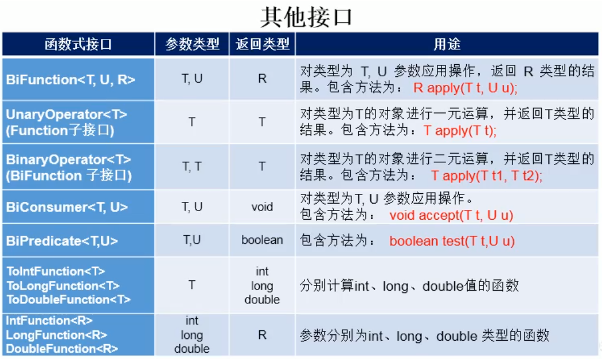
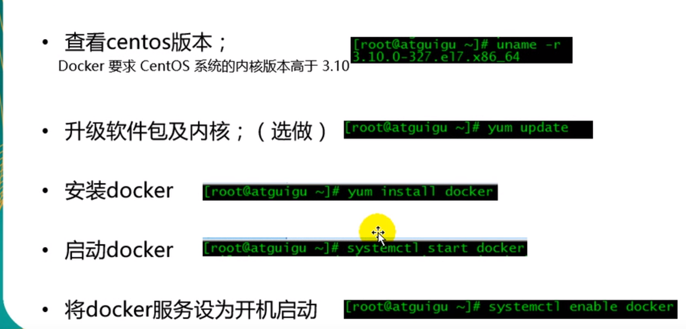
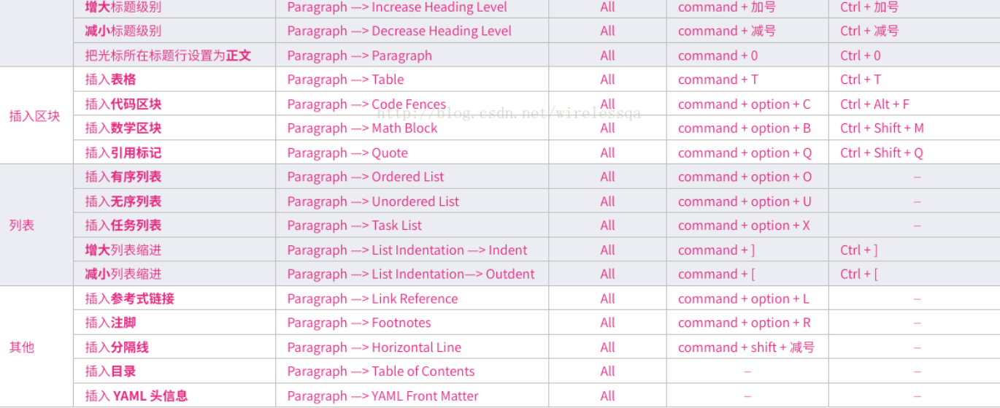

# 	服创学习笔记

# 一.Java后端

## 1.Java语言

---

### ●Lambda表达式

[学习视频](https://www.bilibili.com/video/av62117143?from=search&seid=5915398398558028346)

#### 1.Lambda的本质和用途


---


#### 2.Lanbda基本用法


---


#### 3.Lambda精简用法


---

#### 4.Lambda进阶用法


---


#### 5.系统内置的函数接口





---

### ●Stream流

#### 1.Stream流  

[戳](https://blog.csdn.net/weixin_38361347/article/details/90247695)

#### 2.补充：[skip()和limit()方法及组合使用](https://www.bbsmax.com/A/MyJx27o2dn/)

### ●[正则表达式](https://www.runoob.com/java/java-regular-expressions.html)


### ●小技巧

#### 1.重载的小技巧

```java
public RestData<T> error() {
        return this.error(null);
    }
//无参调用参数为null的单参
    public RestData<T> error(String info) {
        return error(info, null);
    }
//单参调用一个双参，将未用到的参数设为null
    public RestData<T> error(String info, T data) {
        if (info != null && !info.isEmpty()) {
            this.status = false;
            this.info = info;
            this.data = data;
            return this;
        } else {
            return error(FAIL_INFO, data);
        }
    }
```


## 2.Java web

### ●原始JDBC

​	 JDBC(Java DataBase Connectivity) 

```java
try {
// 1、加载数据库驱动
Class.forName(driver);
// 2、获取数据库连接
conn = DriverManager.getConnection(url, username, password);
// 3、获取数据库操作对象
stmt = conn.createStatement();
// 4、定义操作的 SQL 语句句
String sql = "select * from user where id = 6";
// 5、执⾏行行数据库操作
rs = stmt.executeQuery(sql);
// 6、获取并操作结果集
while (rs.next()) {
// 解析结果集
}
} catch (Exception e) {
// ⽇日志信息
} finally {
// 7、关闭资源
}
```


---


## 3.Spring

### ●spring 注解验证@NotNull等使用方法

[[戳]](https://blog.csdn.net/qq920447939/article/details/80198438)

---


## 4.Spring Boot

---

[中文文档](https://docshome.gitbooks.io/springboot/content/pages/boot-documentation.html#boot-documentation-about)

### ● 单元测试

[例子](https://blog.csdn.net/wo541075754/article/details/88983708)    [方法](https://blog.csdn.net/blueheart20/article/details/88899908)

**Note:**使用路径参数和表单参数接受参数的方式不同 [戳](https://blog.csdn.net/wang_muhuo/article/details/84655577)

1.路径参数@PathVariable

2.表单参数@RequestParam

---

### ● 文件上传与下载


#### 1.示例

```java
@RestController
@PropertySource("classpath:application.properties")
@Slf4j
public class FileController {

    @Autowired
    public Constant constant;

    @RequestMapping("/upload")
    public String upload(@RequestParam("file") MultipartFile file) {


        //判断file是否为empty()
        if(file.isEmpty())return "Please select file at first";

        //获取原始名字
        String fileName=file.getOriginalFilename();

        //获取后缀
        String suffix=fileName.substring(fileName.indexOf("."));

        //文件保存路径
        String filePath= constant.getUpload_Folder();

        //生出文件新的保存名称,UUID是为了生成不同的文件名
        fileName=filePath+UUID.randomUUID()+fileName;

        //生成文件对象
        File dest=new File(fileName);

        //判断生成的路径是否存在，若不存在，则创建一个
        if(!dest.getParentFile().exists())dest.getParentFile().mkdirs();

        //将文件保存下来
        try
        {
          /*  将收到的文件传输到给定的目标文件。
            这可以在文件系统中移动文件，在文件系统中复制文件或将内存保存的内容保存到目标文件。如果目标文件已经存在，则将首先删除它。*/
          file.transferTo(dest);
          return "success";
        }
        catch (Exception e)
        {
            return "error";
        }

    }


    @RequestMapping("/download")
    public String download(HttpServletResponse response) {
        try {
            // 文件地址，真实环境是存放在数据库中的
            File file = new File("C:\\upload\\6ce651bf-5627-4759-b153-dd8357b52147机巧少女不会受伤1.jpg");

            // 创建输入流，传入文件对象
            FileInputStream fis = new FileInputStream(file);

            // 设置相关格式
            response.setContentType("application/force-download");

            //设置下载时文件默认的文件名
            String fileName="机巧少女不会受伤.jpg";

            // 设置下载后的文件名以及header
            //URLEncoder避免中文乱码
            response.addHeader("Content-disposition", "attachment;filename="+ URLEncoder.encode(fileName,"UTF-8"));

            //创建输出流
            OutputStream os = response.getOutputStream();

            // 常规操作
            byte[] buf = new byte[1024];
            int len = 0;
            while ((len = fis.read(buf)) != -1) {
                os.write(buf, 0, len);
            }
            os.close();
            fis.close();
            return "success";
        } catch (IOException e) {
            e.printStackTrace();
            return "error";
        }
    }

    //当请求localhost:8080的时候 默认跳转到index.html页面
    //视图解析器
    @RequestMapping("/")
    public ModelAndView index() {
        System.out.println("i am springboot");
        return new ModelAndView("index");
    }
}

```

---

#### [2.下载时文件名中文乱码问题](https://blog.csdn.net/erf_1012/article/details/101026526)

---


### ● 重要注解

##### 1.@EnableAutoConfiguration[注解](https://blog.csdn.net/zxc123e/article/details/80222967)

#### 2.**@Autowired** 与**@Resource**的[区别](https://blog.csdn.net/weixin_40423597/article/details/80643990)

###  ● LomBok

[官方文档](https://projectlombok.org/features/all)

```xml
	    <!--Lombok-->
        <dependency>
            <groupId>org.projectlombok</groupId>
            <artifactId>lombok</artifactId>
            <version>1.16.20</version>
            <scope>provided</scope>
        </dependency>
```


1. **@Setter** 注解在类或字段，注解在类时为所有字段生成setter方法，注解在字段上时只为该字段生成setter方法。

2.  **@Getter** 使用方法同上，区别在于生成的是getter方法。

3. **@ToString** 注解在类，添加toString方法。

   ​    <u>**Note**:默认在比较时不考虑父类的属性，若需要考虑加上@EqualsAndHashCode(callSuper=true)</u>

4. **@EqualsAndHashCode** 注解在类，生成hashCode和equals方法。

   ​	<u>**Note**:默认在比较时不考虑父类的属性，若需要考虑加上@EqualsAndHashCode(callSuper=true)</u>

5. **@NoArgsConstructor** 注解在类，生成无参的构造方法。

6. **@RequiredArgsConstructor** 注解在类，为类中需要特殊处理的字段生成构造方法，比如final和被@NonNull注解的字段。

7. **@AllArgsConstructor** 注解在类，生成包含类中所有字段的构造方法。

8. **@Data** 注解在类，相当于`@Getter @Setter @RequiredArgsConstructor @ToString @EqualsAndHashCode`这5个注解的合集 

9. **@Log4j2**  **@Slf4j  @Commonslog  @...**：注解在类上；为类提供一个 属性名为log 的 log4j2、slf4j、commons-logging、...的日志对像 ，根据日志模块选择相应注解

10. **@Builder**注解在类、构造函数、方法上，

    1.生成一个全参的构造器，一个用于创建构建器的builder（）

    2.在构建器中会生成一个toString()方法和用于创建实体类的build()

    3.并在构建器中创建每一个非final(可赋值)的属性，并创建一个相应的，类似于set方法且返回构造器本身（便于链式调用）的方法

    ```java
    Person.builder() //创建一个构建器
        .name("Adam Savage")//调用name属性的类似set的方法，返回构造器本身
        .city("San Francisco")//因为Person.builder().name()仍然是构造器，可继续
        .job("Mythbusters")//链式调用
        .job("Unchained Reaction")//链式调用
        .build();//创建一个实体并用全参构造器赋值
    //Note:构造器中创建出来的属性值都为null
    //Note:若@Builder的同时加上@Default ,则构造器中创建出来的属性值可为默认的值
    ```

    参考[文献1](https://blog.csdn.net/weixin_41540822/article/details/86606562)，[文献2](https://segmentfault.com/a/1190000018962193)

    

    ---

    

### ● Yaml


---


### ●打包

打包时跳过单元测试

在pom.xml中配置

```xml
<properties>
    <project.build.sourceEncoding>UTF-8</project.build.sourceEncoding>
    <java.version>1.8</java.version>
    <skipTests>
        true
    </skipTests>
</properties>
```

或者pom.xml 同⽬目录下，执⾏行行以下命令

```xml
cd 项⽬目跟⽬目录（和 pom.xml 同级）
mvn clean package  ===>Maven Lifecycle clean
## 或者执⾏行行下⾯面的命令
## 排除测试代码后进⾏行行打包
mvn clean package -Dmaven.test.skip=true ======>在第一种配置情况下Maven Lifecycle package
```


---


### ● SpringBoot 小技巧

#### 1.让属性带上文字说明


---


## 5.Spring Cloud

## 6.Linux


### 1.CentOS

[教程](https://space.bilibili.com/386594979/channel/detail?cid=72612)

#### 1.认知

● CentOS的[目录结构](https://blog.csdn.net/qq_33858250/article/details/81839619)

#### 2. 设置

● CentOS网络[设置](https://blog.csdn.net/xiehd313/article/details/80814584)

● 下载与配置[jdk](https://www.cnblogs.com/sxdcgaq8080/p/7492426.html)

●[下载与配置maven](https://www.cnblogs.com/adawoo/p/11665783.html)  //将教程中的3.6.2改成3.6.3

//若出现每次都需要重启 source /etc/profile才能生效的情况,[参考](https://blog.csdn.net/zh554275855/article/details/89832670)

##### [防火墙](https://blog.csdn.net/zhangjunli/article/details/88721375)和[端口设置](https://blog.csdn.net/zll_0405/article/details/81208606)

tomcat:8080

mysql:3306

redis:6379

elsaticsearch:9200,9300

```shell
firewall-cmd --permanent --zone=public --add-port=8080/tcp  #开启端口 

firewall-cmd --reload  #重启防火墙

firewall-cmd --permanent --zone=public --list-ports  #查看开启的端口
```

● 使用XShell终端[工具](https://blog.csdn.net/q_Catherine/article/details/89162634)

● 搭建ftp服务器

1. [Step one](https://blog.csdn.net/hjw1542254356/article/details/82858698)
2. [Step two](https://blog.csdn.net/j15533415886/article/details/84061857) 注意协议选择Xftp 端口选择22

​	

#### 3.命令

● CentOS常用简单[命令](https://blog.csdn.net/qq_40087415/article/details/79367151)

● CentOS终端Terminal常用[快捷键](https://blog.csdn.net/weixin_42006714/article/details/80834178)

● Vi/Vim[快捷键](https://www.runoob.com/w3cnote/all-vim-cheatsheat.html)  [快捷键中文](https://www.jianshu.com/p/4df654095d73)

● cp -r /mnt/hgfs/SVNSource/ .     复制指定目录到当前目录下

● 结束[端口进程](https://blog.csdn.net/xcyww/article/details/89187698)

●rpm[命令](https://blog.csdn.net/capecape/article/details/78529159)

● 命令意义

​	1.tar

​		1). [tar -zxvf](https://blog.csdn.net/xhf852963/article/details/86483374)  解压缩

 systemctl list-units --type=service --state=running 查看所有正在运行的service


## 7.其他

### 1.GitHub


### 2.Git

---

Git工作流程图


先找一个地方创建自己的版本库

```java
$ mkdir My-note  ---在当前目录下创建一个 My-note文件夹 
$ cd My-note  --- 进入My-note文件夹-->里面的文件都是你的工作区（除了.git）
$ pwd  ---查看当前目录路径
/Users/michael/My-note
```

 

`$ git init`     把一个目录变成Git可管理的目录 增加一个.git文件（就是版本库） 若文件被隐藏可用ls -ah命令查看

`$ git status `查看信息 $ git log 查看commit日志 $ git relog 查看包括被回退的commit日志

`$ git log  --pretty=oneline` 将每一个日志简化为一行

`$ git diff` 文件  查看文件被修改的内容

`$ git add "文件名"`  将指定文件提交到暂存区  `$ git add . ` 将未提交文件提交到暂存区   

`$ git commit -m "提交说明"  `提交暂存区到远程仓库当前分支

`$ git checkout -- fileName `   是用版本库里的版本替换工作区的版本，无论工作区是修改还是删除，都可以“一键还原”。 

`$ git reset HEAD  filename`   可以把暂存区（已add）的修改撤销掉（unstage），重新放回工作区 

`$ git reset --hard HEAD^  `回到上一个版本 HEAD^^上上个版本 HEAD~100上100个版本

`$ rm fileName ` 工作区删除文件

`$ git rm fileName `从暂存区删除掉file
`$ git commit -m "fileName" ` 重新提交  --上述两步使得文件从版本库中删除

在Github上创建一个repository My-note

`$ git remote add origin git@github.com:TheLolita/My-note.git`    使得本地仓库与远程仓库关联  （前提有SSH Key 才能推送操作）

由于远程库是空的，我们第一次推送`master`分支时，加上了`-u`参数，Git不但会把本地的`master`分支内容推送的远程新的`master`分支，还会把本地的`master`分支和远程的`master`分支关联起来，在以后的推送或者拉取时就可以简化命令。`$ git push -u origin master` 

此后，每次本地提交后，只要有必要，就可以使用命令`git push origin master`推送最新修改

`$ git branch` 命令会列出所有分支，当前分支前面会标一个`*`号。 

创建分支：`git branch XXX`   

切换分支：`git checkout `或者`git switch `

创建+切换分支：`git checkout -b `或者`git switch -c `

合并某分支到当前分支：`git merge `

删除分支：`git branch -d `

 `Fast-forward`信息，Git告诉我们，这次合并是“快进模式”，也就是直接把`master`指向`dev`的当前提交，所以合并速度非常快。 

 合并分支时，加上`--no-ff`参数就可以用普通模式合并，合并后的历史有分支，能看出来曾经做过合并，而`fast forward`合并就看不出来曾经做过合并。 

 用`git log --graph`命令可以看到分支合并图 


### 3.IDEA

---

● [取消一些提示和报错](https://blog.csdn.net/weixin_39936341/article/details/82385601?utm_source=blogxgwz3)

● [设置自动生成 serialVersionUID](https://www.cnblogs.com/godtrue/p/7674487.html)  

#### ● 热部署

1.添加依赖

```xml
<dependency>
<groupId>org.springframework.boot</groupId>
<artifactId>spring-boot-Devtools</artifactId>
<optional>true</optional>
</dependency>
```

2.在 plugin 中配置另外⼀一个属性 fork，并且配置为 true。

```xml
<build>
<plugins>
<plugin>
<groupId>org.springframework.boot</groupId>
<artifactId>spring-boot-maven-plugin</artifactId>
<configuration>
<fork>true</fork>
</configuration>
</plugin>
</plugins>
</build>
```

3.配置IDEA


### 4.Maven

---


### 5.MyBatis

[戳](https://mybatis.org/mybatis-3/zh/java-api.html)

```xml
<!--Mybatis-->
<dependency>
    <groupId>org.mybatis.spring.boot</groupId>
    <artifactId>mybatis-spring-boot-starter</artifactId>
    <version>2.1.1</version>
</dependency>
```


#### ● XML配置

 	[resultType](https://www.cnblogs.com/kenhome/p/7764398.html)

​	JdbcType类型和Java[类型的对应关系](https://www.cnblogs.com/lixuwu/p/5916585.html#_label0)

```java
Spring Boot 启动时数据源会⾃自动注⼊入到 SqlSessionFactory 中，使⽤用SqlSessionFactory 构建SqlSessionFactory，再⾃自动注⼊入到 Mapper 中，最后我们直接使⽤用 Mapper 即可。
```

```xml
1.创建model实体类与mapper接口类

2.配置application.properties

mybatis.config-location=classpath:mybatis/mybatis-config.xml

mybatis.mapper-locations=classpath:mybatis/mapper/*.xml

mybatis.type-aliases-package=com.zs.mybatis42.model

spring.datasource.url=jdbc:mysql://localhost:3306/account?serverTimezone=UTC&useUnicode=true&characterEncoding=utf-8&useSSL=true
#SSL的作用:JDBC跟你的数据库连接的时候，你的JDBC版本与MySQL版本不兼容，MySQL的版本更高一些，在连接语句后加上"useSSL='true'" ，就可以连接到数据库了。更高版本
spring.datasource.username=root
spring.datasource.password=zs.1063268673
spring.datasource.driver-class-name=com.mysql.cj.jdbc.Driver

3. 在启动类或..上加上@MapperScan("com.zs.mybatis42.mapper")指定要变成实现类的接口所在的包，然后包下面的所有接口在编译之后都会生成相应的接口实现类

4.在resource中创建一个mybatis文件夹,存放mybatis-config.xml与mapper文件夹

5.创建mybatis-config.xml

<?xml version="1.0" encoding="UTF-8" ?>
<!DOCTYPE configuration PUBLIC "-//mybatis.org//DTD Config 3.0//EN" "http://mybatis.org/dtd/mybatis-3-config.dtd">
<configuration>
	<typeAliases>
		<typeAlias alias="Integer" type="java.lang.Integer" />
		<typeAlias alias="Long" type="java.lang.Long" />
		<typeAlias alias="HashMap" type="java.util.HashMap" />
		<typeAlias alias="LinkedHashMap" type="java.util.LinkedHashMap" />
		<typeAlias alias="ArrayList" type="java.util.ArrayList" />
		<typeAlias alias="LinkedList" type="java.util.LinkedList" />
	</typeAliases>
</configuration>
<!--==================================================================-->    
6.创建mapper映射文件
<?xml version="1.0" encoding="UTF-8" ?>
<!DOCTYPE mapper PUBLIC "-//mybatis.org//DTD Mapper 3.0//EN" "http://mybatis.org/dtd/mybatis-3-mapper.dtd" >

<!--第一步，配置表结构和类的对应关系：-->
<mapper namespace="com.neo.mapper.UserMapper" >
    
    <!--第二步,resultMap 映射关系 type为要和数据库中相应表创建映射的model-->
    <resultMap id="BaseResultMap" type="com.neo.model.User" >
        <id column="id" property="id" jdbcType="BIGINT" />
        <result column="userName" property="userName" jdbcType="VARCHAR" />
        <result column="passWord" property="passWord" jdbcType="VARCHAR" />
        <result column="user_sex" property="userSex" javaType="com.neo.enums.UserSexEnum"/>
        <result column="nick_name" property="nickName" jdbcType="VARCHAR" />
    </resultMap>
    
    <!--第三步,写具体的 SQL 语句-->
    <!--若SQL语句有大量重复,可抽取公用片段-->
    <sql id="Base_Column_List" >
        id, userName, passWord, user_sex, nick_name
    </sql>

    <sql id="Base_Where_List">
        <if test="userName != null  and userName != ''">
            and userName = #{userName}
        </if>
        <if test="userSex != null and userSex != ''">
            and user_sex = #{userSex}
        </if>
    </sql>

    <select id="getAll" resultMap="BaseResultMap"  >
       SELECT 
       <include refid="Base_Column_List" />
	   FROM users
    </select>

    <select id="getList" resultMap="BaseResultMap" parameterType="com.neo.param.UserParam">
        select
        <include refid="Base_Column_List" />
        from users
        where 1=1
        <include refid="Base_Where_List" />
        order by id desc
        limit #{beginLine} , #{pageSize}
    </select>

    <select id="getCount" resultType="Integer" parameterType="com.neo.param.UserParam">
        select
        count(1)
        from users
        where 1=1
        <include refid="Base_Where_List" />
    </select>
    
    <!--注意这里的id即是mapper中的方法名-->

    <select id="getOne" parameterType="Long" resultMap="BaseResultMap" >
        SELECT 
       <include refid="Base_Column_List" />
	   FROM users
	   WHERE id = #{id}
    </select>

    <insert id="insert" parameterType="com.neo.model.User" >
       INSERT INTO 
       		users
       		(userName,passWord,user_sex) 
       	VALUES
       		(#{userName}, #{passWord}, #{userSex})
    </insert>
    
    <update id="update" parameterType="com.neo.model.User" >
       UPDATE 
       		users 
       SET 
       	<if test="userName != null">userName = #{userName},</if>
       	<if test="passWord != null">passWord = #{passWord},</if>
       	nick_name = #{nickName}
       WHERE 
       		id = #{id}
    </update>
    
    <delete id="delete" parameterType="Long" >
       DELETE FROM
       		 users 
       WHERE 
       		 id =#{id}
    </delete>

</mapper>

```

```java
7.web/controller调用

    //注入Mapper
    @Resource //@Resource见SpringBoot--常用注解
    private UserMapper userMapper;

    @RequestMapping("/getUsers")
    public List<User> getUsers() {
        List<User> users=userMapper.getAll();
        return users;
    }
```

#### ● 多数据源设置(基于XML)

```xml
1.在不同的数据库中创建好相应的表结构

2.创建相应Model与Mapper

3.创建mybatis-config.xml

4.创建相对应的mapper映射文件

5.配置数据源
```

```java
//配置第一个数据源，新建 DataSource1Config  加上@Primary表示这是默认数据源

@Configuration
@MapperScan(basePackages = "com.zs.mybatis42.mapper.one", sqlSessionTemplateRef  = "oneSqlSessionTemplate")
public class DataSource1Config {

    //1.⾸首先加载配置的数据源：
    @Bean(name = "oneDataSource")
    @ConfigurationProperties(prefix = "spring.datasource.one")
    @Primary
    public DataSource testDataSource() {
        return DataSourceBuilder.create().build();
    }

    //2.根据创建的数据源，构建对应的 SqlSessionFactory。代码中需要指明需要加载的 Mapper xml ⽂文件。
    @Bean(name = "oneSqlSessionFactory")
    @Primary
    public SqlSessionFactory testSqlSessionFactory(@Qualifier("oneDataSource") DataSource dataSource) throws Exception {
        SqlSessionFactoryBean bean = new SqlSessionFactoryBean();
        bean.setDataSource(dataSource);
        bean.setMapperLocations(new PathMatchingResourcePatternResolver().getResources("classpath:mybatis/mapper/one/*.xml"));
        return bean.getObject();
    }

    //3.同时将数据源添加到事务中。
    @Bean(name = "oneTransactionManager")
    @Primary
    public DataSourceTransactionManager testTransactionManager(@Qualifier("oneDataSource") DataSource dataSource) {
        return new DataSourceTransactionManager(dataSource);
    }
    
    //4.接下来将上⾯面创建的 SqlSessionFactory 注⼊入，创建我们在 Mapper 中需要使⽤用的 SqlSessionTemplate。

    @Bean(name = "oneSqlSessionTemplate")
    @Primary
    public SqlSessionTemplate testSqlSessionTemplate(@Qualifier("oneSqlSessionFactory") SqlSessionFactory sqlSessionFactory) throws Exception {
        return new SqlSessionTemplate(sqlSessionFactory);
    }

}
//5.最后将上⾯面创建的 SqlSessionTemplate 注⼊入到对应的 Mapper 包路路径下，这样这个包下⾯面的 Mapper 都会使⽤用第⼀一个数据源来进⾏行行数据库操作。(类上的@MapperScan)


/**
总结:

从上⾯面的步骤我们可以总结出来，配置类中创建多数据源的过程就是：

1.首先创建 DataSource

2.注⼊入到SqlSessionFactory 中

3.再创建事务

4.将 SqlSessionFactory 注⼊入到创建的 SqlSessionTemplate 中

5.最后将SqlSessionTemplate 注⼊入到对应的 Mapper 包路路径下。其中需要指定分库的 Mapper 包路路径。
*/

//===========================================================================

//配置第二个数据源，新建 DataSource2Config  
@Configuration
@MapperScan(basePackages = "com.zs.mybatis42.mapper.two", sqlSessionTemplateRef  = "twoSqlSessionTemplate")
public class DataSource2Config {

    @Bean(name = "twoDataSource")
    @ConfigurationProperties(prefix = "spring.datasource.two")
    public DataSource testDataSource() {
        return DataSourceBuilder.create().build();
    }

    @Bean(name = "twoSqlSessionFactory")
    public SqlSessionFactory testSqlSessionFactory(@Qualifier("twoDataSource") DataSource dataSource) throws Exception {
        SqlSessionFactoryBean bean = new SqlSessionFactoryBean();
        bean.setDataSource(dataSource);
        bean.setMapperLocations(new PathMatchingResourcePatternResolver().getResources("classpath:mybatis/mapper/two/*.xml"));
        return bean.getObject();
    }

    @Bean(name = "twoTransactionManager")
    public DataSourceTransactionManager testTransactionManager(@Qualifier("twoDataSource") DataSource dataSource) {
        return new DataSourceTransactionManager(dataSource);
    }

    @Bean(name = "twoSqlSessionTemplate")
    public SqlSessionTemplate testSqlSessionTemplate(@Qualifier("twoSqlSessionFactory") SqlSessionFactory sqlSessionFactory) throws Exception {
        return new SqlSessionTemplate(sqlSessionFactory);
    }

}

```

```properties
#6.配置application.properties
mybatis.config-location=classpath:mybatis/mybatis-config.xml

spring.datasource.one.jdbc-url=jdbc:mysql://localhost:3306/user1?serverTimezone=UTC&useUnicode=true&characterEncoding=utf-8&useSSL=true
spring.datasource.one.username=root
spring.datasource.one.password=zs.1063268673
spring.datasource.one.driver-class-name=com.mysql.cj.jdbc.Driver

spring.datasource.two.jdbc-url=jdbc:mysql://localhost:3306/user2?serverTimezone=UTC&useUnicode=true&characterEncoding=utf-8&useSSL=true
spring.datasource.two.username=root
spring.datasource.two.password=zs.1063268673
spring.datasource.two.driver-class-name=com.mysql.cj.jdbc.Driver
```

```java
//7.web/controller中调用
@RestController
public class UserController {
	
	@Resource
	private User1Mapper user1Mapper;

	@Resource
    private User2Mapper user2Mapper;
	
	@RequestMapping("/getUsers")
    public List<User> getUsers() {
        List<User> users=user1Mapper.getAll();
        return users;
    }

    @RequestMapping("/add")
    public void save(User user) {
    	user1Mapper.insert(user);
    }

    @RequestMapping(value="update")
    public void update(User user) {
    	user2Mapper.update(user);
    }
}
```

#### ● 注解配置

```java
//注解版的mybatis重点在于对mapper里sql语句的编写,配置相对xml简单不少
//例:
public interface UserMapper {
	
	@Select("SELECT * FROM users")
	@Results({
		@Result(property = "userSex",  column = "user_sex", javaType = UserSexEnum.class),
		@Result(property = "nickName", column = "nick_name")
	})
	List<User> getAll();

	@SelectProvider(type = UserSql.class, method = "getList")
	List<User> getList(UserParam userParam);

	@Select("SELECT * FROM users WHERE user_sex = #{user_sex}")
	List<User> getListByUserSex(@Param("user_sex") String userSex);

	@Select("SELECT * FROM users WHERE username=#{username} AND user_sex = #{user_sex}")
	List<User> getListByNameAndSex(Map<String, Object> map);

	@SelectProvider(type = UserSql.class, method = "getCount")
	int getCount(UserParam userParam);
	
	@Select("SELECT * FROM users WHERE id = #{id}")
	@Results({
		@Result(property = "userSex",  column = "user_sex", javaType = UserSexEnum.class),
		@Result(property = "nickName", column = "nick_name")
	})
	User getOne(Long id);

	@Insert("INSERT INTO users(userName,passWord,user_sex) VALUES(#{userName}, #{passWord}, #{userSex})")
	void insert(User user);

	@Update("UPDATE users SET userName=#{userName},nick_name=#{nickName} WHERE id =#{id}")
	void update(User user);

	@Update({"<script> ",
			"update users " ,
			"<set>" ,
			" <if test='userName != null'>userName=#{userName},</if>" ,
			" <if test='nickName != null'>nick_name=#{nickName},</if>" ,
			" </set> ",
			"where id=#{id} " ,
			"</script>"})
	void updateUser(User user);

	@Delete("DELETE FROM users WHERE id =#{id}")
	void delete(Long id);

}
```

使⽤用 SQL 构建类来⽀支持

```java

public class UserSql {

    private static final Logger log = LoggerFactory.getLogger(UserSql.class);

    public String getList(UserParam userParam) {
        StringBuffer sql = new StringBuffer("select id, userName, passWord, user_sex as userSex, nick_name as nickName");
        sql.append(" from users where 1=1 ");
        if (userParam != null) {
            if (!StringUtils.isEmpty(userParam.getUserName())) {
                sql.append(" and userName = #{userName}");
            }
            if (!StringUtils.isEmpty(userParam.getUserSex())) {
                sql.append(" and user_sex = #{userSex}");
            }
        }
        sql.append(" order by id desc");
        sql.append(" limit " + userParam.getBeginLine() + "," + userParam.getPageSize());
        log.info("getList sql is :" +sql.toString());
        return sql.toString();
    }

    public String getCount(UserParam userParam) {
       String sql= new SQL(){{
            SELECT("count(1)");
            FROM("users");
            if (!StringUtils.isEmpty(userParam.getUserName())) {
                WHERE("userName = #{userName}");
            }
            if (!StringUtils.isEmpty(userParam.getUserSex())) {
                WHERE("user_sex = #{userSex}");
            }
            //从这个toString可以看出，其内部使用高效的StringBuilder实现SQL拼接
        }}.toString();

        log.info("getCount sql is :" +sql);
        return sql;
    }
}

```


---


### 6.JPA

#### ● 什么是JPA?


JPA有多种实现：TopLink、OpenJpa、Hibernate


---

#### ● GeneratedValue的四种生成策略


---

#### ● JPA常用注解

##### **@Enumerated**

@Enumerated(value=EnumType.ORDINAL)采用枚举类型的序号值与数据库进行交互 （默认）

@Enumerated(value=EnumType.STRING)采用枚举类型与数据库进行交互 

---


##### @MappedSuperclass

@MappedSuperclass 用于标识父类，生成子类的通用属性如Id、CreateTime、UpdateTime等

---


#### ●JPA公共Bean


Desc 降序   Asc升序 


● JPA设置多数据源

```java
//DataSourceConfig
@Configuration
public class DataSourceConfig {

    @Autowired
    private JpaProperties jpaProperties;
    @Autowired
    private HibernateProperties hibernateProperties;

    @Bean(name = "primaryDataSource")
    @Primary
    @ConfigurationProperties("spring.datasource.primary")
    public DataSource firstDataSource() {
        return DataSourceBuilder.create().build();
    }

    @Bean(name = "secondaryDataSource")
    @ConfigurationProperties("spring.datasource.secondary")
    public DataSource secondDataSource() {
        return DataSourceBuilder.create().build();
    }

    @Bean(name = "vendorProperties")
    public Map<String, Object> getVendorProperties() {
        return hibernateProperties.determineHibernateProperties(jpaProperties.getProperties(), new HibernateSettings());
    }
}

```

```java
//PrimartConfig

@Configuration
@EnableTransactionManagement
@EnableJpaRepositories(
		entityManagerFactoryRef="entityManagerFactoryPrimary",
		transactionManagerRef="transactionManagerPrimary",
		basePackages= { "com.neo.repository.test1" })//设置dao（repo）所在位置
public class PrimaryConfig {

    @Autowired
    @Qualifier("primaryDataSource")
    private DataSource primaryDataSource;

    @Autowired
    @Qualifier("vendorProperties")
    private Map<String, Object> vendorProperties;

    @Bean(name = "entityManagerFactoryPrimary")
    @Primary
    public LocalContainerEntityManagerFactoryBean entityManagerFactoryPrimary (EntityManagerFactoryBuilder builder) {
        return builder
                .dataSource(primaryDataSource)
                .properties(vendorProperties)
                .packages("com.neo.model") //设置实体类所在位置
                .persistenceUnit("primaryPersistenceUnit")
                .build();
    }

    @Bean(name = "entityManagerPrimary")
    @Primary
    public EntityManager entityManager(EntityManagerFactoryBuilder builder) {
        return entityManagerFactoryPrimary(builder).getObject().createEntityManager();
    }

    @Bean(name = "transactionManagerPrimary")
    @Primary
    PlatformTransactionManager transactionManagerPrimary(EntityManagerFactoryBuilder builder) {
        return new JpaTransactionManager(entityManagerFactoryPrimary(builder).getObject());
    }

}
```

```java
//SecondaryConfig

@Configuration
@EnableTransactionManagement
@EnableJpaRepositories(
        entityManagerFactoryRef="entityManagerFactorySecondary",
        transactionManagerRef="transactionManagerSecondary",
        basePackages= { "com.neo.repository.test2" })
public class SecondaryConfig {

    @Autowired
    @Qualifier("secondaryDataSource")
    private DataSource secondaryDataSource;

    @Autowired
    @Qualifier("vendorProperties")
    private Map<String, Object> vendorProperties;

    @Bean(name = "entityManagerFactorySecondary")
    public LocalContainerEntityManagerFactoryBean entityManagerFactorySecondary (EntityManagerFactoryBuilder builder) {
        return builder
                .dataSource(secondaryDataSource)
                .properties(vendorProperties)
                .packages("com.neo.model")
                .persistenceUnit("secondaryPersistenceUnit")
                .build();
    }

    @Bean(name = "entityManagerSecondary")
    public EntityManager entityManager(EntityManagerFactoryBuilder builder) {
        return entityManagerFactorySecondary(builder).getObject().createEntityManager();
    }

    @Bean(name = "transactionManagerSecondary")
    PlatformTransactionManager transactionManagerSecondary(EntityManagerFactoryBuilder builder) {
        return new JpaTransactionManager(entityManagerFactorySecondary(builder).getObject());
    }

}
```


---


### 7.Spring MVC

### 8.Docker

#### ● 安装



#### ●Docker命令

[命令 ](https://www.cnblogs.com/DeepInThought/p/10896790.html) 

[命令](https://blog.csdn.net/liqz666/article/details/82180581)


 

==>访问8080却显示不了页面,...改防火墙,端口,版本等一系列操作后却发现原来是这个[原因](https://blog.csdn.net/xSn_123/article/details/104037728).......

#### ●Dokcer设置

1. 设置[加速器](https://blog.csdn.net/cacacai/article/details/80461733)

2. 拉取指定版本[Tag]的[镜像](https://blog.csdn.net/kevinsingapore/article/details/81388611)

3. 容器自启动

   [方法1](https://blog.csdn.net/qq_19734597/article/details/95234236)  $ docker container update --restart=always 容器名字 

   [方法2](https://www.cnblogs.com/gsxl/p/11830147.html)  写shell脚本

#### ●注意

1）Mysql

启动mysql容器需要密码

\# docker run --name mysql -e MYSQL_ROOT_PASSWORD=123456 -d -p 3306:3306 mysql

\# docker exec -it mysql /bin/bash  或\# docker exec -it c84fc698f9c4 /bin/bash进入容器  [名称或id] [空格] [/bin/bash路径]

使用mysql> ALTER USER 'root'@'%' IDENTIFIED WITH mysql_native_password BY 'yourPassword';修改密码

注意是'root'@'%' 而不是'root'@'localhost'


[详细](https://www.jianshu.com/p/e7d088f4fd13)


### 9.Redis

[中文文档](http://www.redis.cn/commands.html)

#### 1.功能

##### ●以Json格式存入缓存

1)	导入jackson

```xml
<!--json-->
<dependency>
    <groupId>com.fasterxml.jackson.core</groupId>
    <artifactId>jackson-databind</artifactId>
</dependency>
```

```java
@Bean
    public RedisTemplate<String, Object> redisTemplate(RedisConnectionFactory redisConnectionFactory) {
        Jackson2JsonRedisSerializer<Object> serializer = new Jackson2JsonRedisSerializer<Object>(Object.class);
        ObjectMapper objectMapper = new ObjectMapper();
        objectMapper.setVisibility(PropertyAccessor.ALL, JsonAutoDetect.Visibility.ANY);
        objectMapper.enableDefaultTyping(ObjectMapper.DefaultTyping.NON_FINAL);
        serializer.setObjectMapper(objectMapper);
        RedisTemplate<String, Object> redisTemplate = new RedisTemplate<>();
        redisTemplate.setConnectionFactory(redisConnectionFactory);
        redisTemplate.setKeySerializer(new StringRedisSerializer());
        redisTemplate.setValueSerializer(serializer);
        redisTemplate.setHashKeySerializer(new StringRedisSerializer());
        redisTemplate.setHashValueSerializer(serializer);
        redisTemplate.afterPropertiesSet();
        return redisTemplate;
    }
    @Bean
    public RedisCacheManager redisCacheManager(RedisTemplate redisTemplate) {
        RedisCacheWriter redisCacheWriter = RedisCacheWriter.nonLockingRedisCacheWriter(redisTemplate.getConnectionFactory());
        RedisCacheConfiguration redisCacheConfiguration = RedisCacheConfiguration.defaultCacheConfig()    .serializeValuesWith(RedisSerializationContext.SerializationPair.fromSerializer(redisTemplate.getValueSerializer()));
        return new RedisCacheManager(redisCacheWriter, redisCacheConfiguration);
    }
```


### 10.MySQL

#### ●小用法

##### 1.select count()、select count(1)、select count(*)的[区别](https://www.jb51.net/article/158106.htm)

###### 2.[时区问题](https://www.cnblogs.com/mracale/p/6064447.html)

3.使用函数批量注入数据[1)](https://blog.csdn.net/qq_15158911/article/details/87874806), [2)](https://zhidao.baidu.com/question/2011004999053795868.html)

```sql
#注意字符串使用CONCAT(A,B)拼接,数字可直接+
BEGIN
declare i int;
set i=1  ;
while i<1001 do
insert into
users (`userName`,`email`,`phoneNumber`,`password`)VALUES( CONCAT('尼尔_',CONVERT(i,CHAR)),CONCAT(CONVERT(199600000+i,CHAR),'m@qq.com'),CONVERT(13656000000+i,CHAR),'zs.1063268673');
set i=i+1;
end while;
END
```


### 11.Druid

### 12.RabbitMQ

[安装](https://blog.csdn.net/weixin_39735923/article/details/79288578?tdsourcetag=s_pctim_aiomsg)

### 14.MongoDB

[安装](https://blog.csdn.net/Woo_home/article/details/89162522)

### 15.Elasticsearch

[安装](https://blog.csdn.net/weixin_42633131/article/details/82902812)


---

### 16.Postman

get请求中文传参需要选中中文,右键选择编码


---


### 17.文件

```xml
<!--mybatis-->
<?xml version="1.0" encoding="UTF-8" ?>
<!DOCTYPE configuration PUBLIC "-//mybatis.org//DTD Config 3.0//EN" "http://mybatis.org/dtd/mybatis-3-config.dtd">
```


# 二.Java前端

## 1.HTML

## 2.CSS

## 3.JavaScript

## 4.Thymeleaf

● [分页](https://www.runoob.com/bootstrap4/bootstrap4-pagination.html)

---

## 5.Vue


安装参考 [1](https://www.cnblogs.com/benyu-aimao/p/8944475.html ) [2](https://blog.csdn.net/weixin_42603009/article/details/91477222) [3](https://www.cnblogs.com/ggjun/p/10990215.html) [4](https://blog.csdn.net/weixin_42470791/article/details/82833415)

npm init -y 初始化package.json

 npm install -g cnpm --registry=[http://registry.npm.taobao.org](http://registry.npm.taobao.org/) 安装淘宝镜像 以后用cnpm代替npm

创建[vue模板](https://blog.csdn.net/y562363753/article/details/94431921)

[官方文档](https://cn.vuejs.org/)


一:属性

二:事件

三:插槽

1.  父级的填充内容如果指定到子组件的没有对应名字插槽，那么该内容**不会**被填充到默认插槽中。
2.  如果子组件没有默认插槽，而父级的填充内容指定到默认插槽中，那么该内容就“**不会**”填充到子组件的任何一个插槽中
3. 如果子组件有多个默认插槽，而父组件所有指定到默认插槽的填充内容，将“**会**” “**全都**”填充到子组件的每个默认插槽中。


---


# 三.爬坑记录

## 1.遇见的错误及解决方法


●  “IPv4 forwarding is disabled. Networking will not work” 的[解决办法](https://blog.csdn.net/Tilyp/article/details/90700917)

●  2019-03-06T07:03:24.000+0000  -->2019-03-06 07:03:24 时间戳统一转换

```xml
#时间戳统一转换
spring.jackson.date-format=yyyy-MM-dd HH:mm:ss
spring.jackson.time-zone=GMT+8
```

## 2.小知识点与注意点

## 3.功能实现

#### ●  更换网页图标

1.用[IOC转换工具](http://www.bitbug.net)制作出自己喜欢的ioc图标，命名为favicon.ioc

2.将favicon.ioc放在静态资源目录下

```java
"classpath:/META-INF/resources/", 
"classpath:/resources/",
"classpath:/static/",
"classpath:/public/"

```

3.在application.properties/yaml配置文件中设置

```xml
spring.mvc.favicon.enabled=false
```

4.在每一个html页面的Head中加入Link（理论前3步即可完成配置）


```java
<link rel="icon" type="image/x-icon" th:href="@{/asserts/img/favicon.ico}">
 //我的favicon.ioc放在static/asserts/img目录下，注意此处使用相对路径 
```

5.若网页未成功显示新的图标，则清除浏览器缓存

---

#### ● 更换IDEA启动时的Banner

单纯好玩[手动滑稽]


在[字符画工具](http://patorjk.com/software/taag/#p=display&h=0&v=3&f=3D%20Diagonal&t=ZSNB)制作出自己喜欢的Banner,保存为`banner.txt`放在resource目录下


---


# 四.小工具

## 1.Typora

---

### ● Typora基本用法

[typora--官方文档](http://support.typora.io/Markdown-Reference/#headers)

[中文文档](https://www.w3cschool.cn/markdownyfsm/markdownyfsm-odm6256r.html)

[Typora--快捷键表](https://blog.csdn.net/HL4854/article/details/81279859)


---

[查看更多快捷键](https://www.cnblogs.com/hongdada/p/9776547.html)




 行内代码 ：代码的两端各加一个“`”号，（在Tab键上面，英文输入法）。  

在'#'号等特殊字符前使用'\\'转义

---

### ● 怎么用Typora和Git打造自己的云笔记？

[戳](https://blog.csdn.net/oPengXiaoLiang/article/details/100678908)

---

## 	2.[IOC转换工具](http://www.bitbug.net)

---

## 3. TortoiseSVN 

[用于拉取Github一个项目中的一个文件或子文件夹]

[1.安装 TortoiseSVN教程](https://jingyan.baidu.com/article/219f4bf78454d3de442d3885.html)

2.[TortoiseSVN下载地址](https://tortoisesvn.net/downloads.html)

3.[使用TortoiseSVN拉取版本](https://blog.csdn.net/weixin_38801572/article/details/87696732)

4.IDEA打开后提示：Can't use Subversion command line client: svn The path to the Subversion executable is probably wrong (Fix it)

点击Fix it 或进入 file->settings->Version Contorl->subversion->with command line client ，在TortoiseSVN安装目录下 找到一个svn.exe的文件，一路OK就行了 

5.拉取来的项目没有接受版本控制,因此.idea会显示红色


只要在版本控制中申明不对此项目进行版本控制就可以了


在+里选中当前项目就可以了

---


## [4.VMware虚拟机](https://blog.csdn.net/java_xinshou1/article/details/100010099)


1.安装[VMWare Pro](https://www.cnblogs.com/elttwl/p/11083486.html)

2.先下载[CentOS7镜像](https://www.jianshu.com/p/a63f47e096e8)

3.[VMWare 安装CentOS](https://blog.csdn.net/java_xinshou1/article/details/100010099)


## 5.可视化工具

Navicat [贫穷](https://blog.csdn.net/songpeiying/article/details/88065187)拯救者


## 6.阿里云服务器


● 添加安全组

## 7.VSCode

1.vscode常用[插件和快捷键](https://blog.csdn.net/weixin_45601379/article/details/100550421)


汉化: Ctrl+shift+P,弹出命令行，选择"Configure Display Language" 


